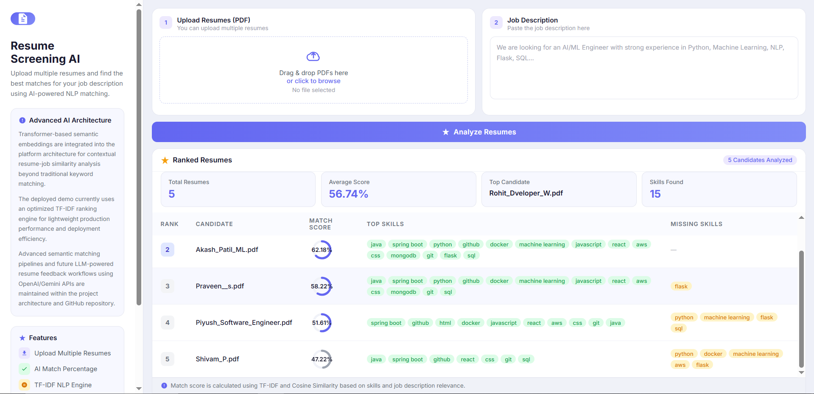

# Resume Screening AI 🚀

An AI-powered Resume Screening and Candidate Ranking Platform that analyzes resumes against job descriptions using NLP, TF-IDF, semantic similarity concepts, and recruiter-focused analytics dashboards.

Built with modern AI engineering concepts including:

- Resume parsing
- Skill extraction
- Candidate ranking
- Semantic matching
- Vector search systems
- AI-ready scalable architecture

---
# 🌐 Live Demo

🔗 Live Application:
https://resume-screening-ai-v1m8.onrender.com

---

# 📸 Project Preview

## Recruiter Dashboard




# 🚀 Features

## ✅ Core ATS Features

- Upload multiple resumes (PDF)
- Extract text from resumes
- TF-IDF based resume-job matching
- Candidate ranking system
- Matched skills analysis
- Missing skills detection
- Recruiter analytics dashboard
- SQLite database integration
- Modern recruiter-focused UI

---

# 🧠 Advanced AI Architecture

The platform architecture includes modern AI engineering concepts such as:

- Transformer-based semantic embeddings
- Semantic similarity workflows
- FAISS vector search pipelines
- Future LLM-powered resume feedback systems
- OpenAI/Gemini API integration roadmap

The deployed demo currently uses an optimized TF-IDF engine for lightweight production deployment.

Advanced semantic AI modules are maintained within the project architecture and GitHub repository.

---

# 🛠️ Tech Stack

## Backend
- Python
- Flask

## AI / NLP
- Scikit-learn
- spaCy
- Sentence Transformers
- FAISS

## Database
- SQLite

## Frontend
- HTML
- CSS

## Deployment
- Render

---

# 📂 Project Structure

```bash
resume-screening-ai/
│
├── app.py
├── requirements.txt
├── runtime.txt
│
├── uploads/
│
├── static/
│   └── style.css
│
├── templates/
│   └── index.html
│
├── src/
│   ├── extract_text.py
│   ├── similarity_engine.py
│   ├── semantic_matcher.py
│   ├── skill_extractor.py
│   ├── skill_matcher.py
│   ├── ranker.py
│   ├── database.py
│   ├── vector_store.py
│   └── vector_search_demo.py
```

---

# ⚙️ Installation

## Clone Repository

```bash
git clone https://github.com/akashivu/resume-screening-ai.git
```

```bash
cd resume-screening-ai
```

---

# 📦 Install Dependencies

```bash
pip install -r requirements.txt
```

---

# ▶️ Run Application

```bash
python app.py
```

Application runs on:

```bash
http://127.0.0.1:5000
```

---

# 🧪 AI Concepts Implemented

## TF-IDF Matching

Used for lightweight keyword relevance scoring.

---

## Skill Extraction

Extracts recruiter-relevant technical skills using NLP workflows.

---

## Semantic Embedding Architecture

Transformer-based semantic matching architecture using Sentence Transformers.

---

## Vector Search

FAISS-based vector retrieval system for semantic resume search workflows.

---

# 📈 Future Enhancements

- LLM-powered resume feedback
- RAG-based recruiter assistant
- OpenAI/Gemini integration
- Vector database integration
- Candidate recommendation engine
- AI interview assistant
- Resume improvement suggestions

---

# 💡 Learning Outcomes

This project helped explore:

- NLP pipelines
- Semantic similarity systems
- Vector search architecture
- AI deployment optimization
- Backend engineering
- Recruiter workflow design
- Production deployment concepts
- Git branching workflows

---

# 👨‍💻 Author

Akash Patil

GitHub:
https://github.com/akashivu

---

# ⭐ If you found this project useful

Give this repository a star ⭐